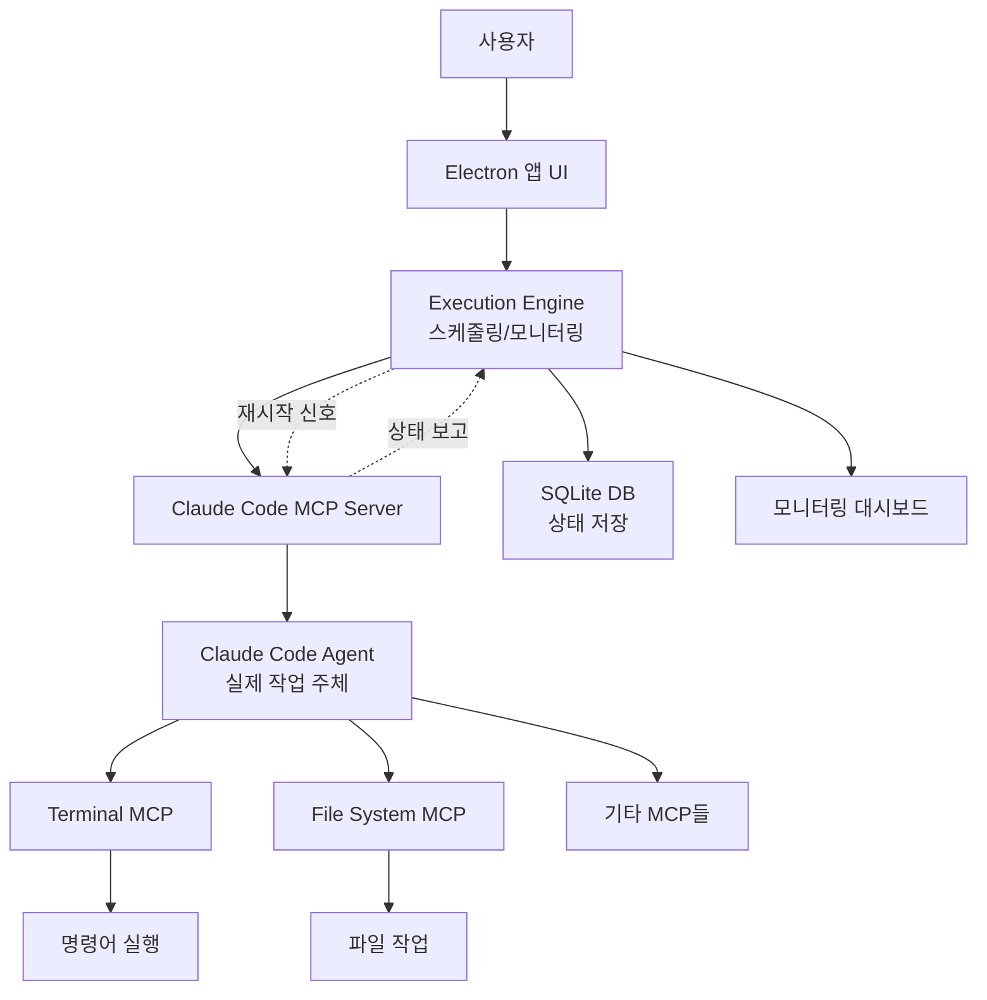

# 📋 PRD: Claude Code Nightshift (CCN)

## **제품 개요**

### **비전**

*"자는 시간이 아까우신가요? 당신이 잠든 사이, AI가 일합니다"*

개발자가 잠든 시간에도 프로젝트가 진행되도록 하는 완전 자동화된 AI 개발 도구. Claude Code가 주도적으로 작업을 수행하며, 24시간 무중단 모니터링을 통해 안정적인 개발 진행을 보장합니다.

### **핵심 가치**

- **자율성**: Claude Code가 주도적으로 작업 수행
- **연속성**: 24시간 무중단 개발 진행
- **가시성**: 실시간 진행 상황 모니터링
- **안정성**: 지능형 감시 및 자동 복구

### **타겟 사용자**

- Claude Code Max 플랜 사용자
- AI에게 개발을 완전히 위임하고 싶은 개발자
- 시간 효율성을 극대화하고자 하는 스타트업/프리랜서

## **시스템 아키텍처**

### **핵심 구조**



### **역할 정의**

### 1. **Execution Engine (감시자)**

- 스케줄링 및 작업 큐 관리
- Claude Code 상태 모니터링
- 진행 상황 UI 업데이트
- 문제 감지 시 재시작 신호 전송
- **직접 실행하지 않음**

### 2. **Claude Code (실행자)**

- PRD 분석 및 태스크 생성
- 모든 실제 작업 수행
- Terminal MCP를 통한 명령 실행
- File System MCP를 통한 파일 작업
- 작업 순서 및 방법 자율 결정

## **핵심 기능**

### **1. PRD 기반 자동 개발 시스템**

### 1.1 PRD 제출 및 전달

```tsx

typescript
interface PRDSubmission {
// 사용자가 PRD 작성
  submitPRD(content: string): Promise<JobId>

// Engine이 Claude Code에게 전달
  forwardToClaudeCode(prd: string): Promise<void>

// Claude Code가 자율적으로 실행// (Engine은 관여하지 않음)
}

```

### 1.2 Claude Code 주도 실행

```jsx

javascript
// Claude Code가 실행하는 코드 예시
async function executePRD(prd) {
// 1. PRD 분석
  const plan = await analyzePRD(prd)

// 2. MCP 연결
  const terminal = await connectMCP('terminal')
  const fileSystem = await connectMCP('filesystem')

// 3. 자율적 실행
  for (const task of plan.tasks) {
// Claude Code가 스스로 판단하여 실행
    if (needsTerminal(task)) {
      await terminal.execute(task.command)
    }
    if (needsFileOperation(task)) {
      await fileSystem.write(task.file)
    }
  }
}

```

### **2. 실시간 모니터링 시스템**

### 2.1 상태 추적 (읽기 전용)

```tsx

typescript
interface MonitoringSystem {
// Engine은 오직 관찰만
  observeClaudeCode(): {
    status: 'running' | 'stuck' | 'completed'
    currentTask: string
    progress: number
    logs: string[]
  }

// 시각화
  updateDashboard(status: Status): void

// 문제 감지
  detectIssues(): Issue[]
}

```

### 2.2 지능형 개입

```jsx

javascript
class SmartIntervention {
  async monitor(jobId) {
    const status = await this.getStatus(jobId)

    if (status.stuckDuration > this.threshold) {
// 재시작 신호만 보냄
      await this.claudeCodeMCP.signal('restart', jobId)

// Claude Code가 알아서 복구// Engine은 더 이상 관여하지 않음
    }
  }
}

```

### **3. 비주얼 워크플로우 대시보드**

### 3.1 실시간 DAG 시각화

- Claude Code의 작업 진행 상황 표시
- 현재 실행 중인 태스크 하이라이트
- 완료/실패/진행중 상태 색상 구분

### 3.2 로그 스트리밍

```tsx

typescript
interface LogStreaming {
// Claude Code의 실시간 출력
  claudeCodeLogs: Observable<string>

// Terminal MCP 출력
  terminalOutput: Observable<string>

// 통합 로그 뷰
  combinedView: LogEntry[]
}

```

### **4. 고급 모니터링 및 분석**

### 4.1 하이브리드 모니터링 아키텍처

```tsx

typescript
interface HybridMonitoring {
// 외부 도구 통합
  external: {
    claudeCodeUsageMonitor: {
      apiCalls: number
      tokenUsage: number
    }
  }

// 내부 모니터링 (관찰만)
  internal: {
    taskProgress: TaskMonitor// 진행률 추적
    performance: PerformanceMonitor// 실행 시간 측정
    patterns: PatternAnalyzer// 작업 패턴 분석
  }
}

```

### 4.2 인사이트 대시보드

- **효율성 메트릭**: 시간당 완료 태스크
- **패턴 인식**: Claude Code의 작업 스타일 분석
- **병목 지점**: 자주 막히는 부분 식별
- **최적화 제안**: 더 나은 PRD 작성법 추천

### **5. 체크포인트 및 복구 시스템**

### 5.1 자동 상태 저장

```jsx

javascript
class CheckpointSystem {
// 5분마다 Claude Code 상태 스냅샷
  async saveCheckpoint() {
    const state = await this.claudeCodeMCP.getState()
    await this.db.save({
      timestamp: Date.now(),
      state: state,
      completedTasks: state.completed,
      currentTask: state.current
    })
  }
}

```

### 5.2 스마트 복구

```jsx

javascript
// Engine이 재시작 신호를 보내면// Claude Code가 자율적으로 복구
async function handleRestart(signal) {
  if (signal.type === 'restart') {
// Claude Code가 스스로 이전 상태 확인
    const lastState = await getLastCheckpoint()

// 중단된 지점부터 재개
    await resumeFrom(lastState.currentTask)
  }
}

```

## **기술 스택**

### **프론트엔드 (AI가 코딩하기 쉬운 스택)**

- **Framework**: Electron (AI가 가장 잘 아는 프레임워크)
- **UI Library**: React + Tailwind CSS
- **상태관리**: Zustand (Pinia보다 AI가 더 잘 다룸)
- **시각화**: D3.js / Recharts
- **컴포넌트**: shadcn/ui (복사-붙여넣기 가능)

### **백엔드**

- **Runtime**: Node.js
- **데이터베이스**: SQLite
- **프로세스 관리**: Node.js child_process
- **로깅**: Winston

### **통합**

- **Claude Code MCP Server**: 상태 확인 및 제어
- **Terminal MCP**: Claude Code가 직접 사용
- **File System MCP**: Claude Code가 직접 사용
- **모니터링**: Claude Code Usage Monitor (외부) + 자체 구현

## **UI/UX 디자인**

### **메인 레이아웃**

```

┌─────────────────────────────────────────────────────┐
│  🌙 Claude Code Nightshift              [−][□][×]   │
├─────────────┬───────────────────────┬───────────────┤
│             │                       │               │
│  PRD Editor │   Workflow Status     │  Live Output  │
│             │                       │               │
│ [New PRD]   │   ⚡ Claude Working   │ > Installing.. │
│             │                       │ > Building...  │
│ # My App    │   [=====>    ] 67%   │ > Testing...   │
│ Create a    │                       │ ✓ Task done    │
│ React app   │   Current: Building   │               │
│ with...     │   Next: Testing       │               │
│             │                       │               │
├─────────────┴───────────────────────┴───────────────┤
│ 🟢 Claude: Active | Tasks: 12/18 | Time: 2h 34m     │
└─────────────────────────────────────────────────────┘

```

### **상태 표시**

- 🟢 Active: Claude Code 작업 중
- 🟡 Thinking: 다음 단계 결정 중
- 🔴 Stuck: 개입 필요
- ⚡ Working: 고속 처리 중

## **개발 로드맵 (AI 주도 개발)**

### **Phase 1: 기본 구조 (1주)**

```markdown

markdown
AI에게 요청:
"Electron + React + Tailwind로 기본 앱 구조를 만들어줘.
좌측 PRD 에디터, 중앙 상태 표시, 우측 로그 뷰어로 구성"

```

### **Phase 2: Claude Code 연동 (2주)**

```markdown

markdown
AI에게 요청:
"Claude Code MCP Server와 연동하는 코드를 작성해줘.
PRD를 전달하고 상태를 모니터링하는 기능 포함"

```

### **Phase 3: 모니터링 시스템 (2주)**

```markdown

markdown
AI에게 요청:
"실시간 모니터링 대시보드를 구현해줘.
진행률 표시, 로그 스트리밍, 상태 시각화 포함"

```

### **Phase 4: 고급 기능 (2주)**

```markdown

markdown
AI에게 요청:
"체크포인트 시스템과 자동 복구 기능을 추가해줘.
SQLite에 상태 저장, 문제 감지 시 자동 재시작"

```

## **핵심 차별점**

### **1. Claude Code 중심 설계**

- Engine은 감시만, Claude Code가 모든 실행
- 자율적인 작업 수행 보장
- 최소한의 개입으로 최대 효율

### **2. AI 친화적 개발**

- 모든 코드를 AI가 생성 가능
- 표준화된 패턴 사용
- 복잡한 로직 최소화

### **3. 실용적 모니터링**

- 필요한 정보만 추적
- 과도한 개입 방지
- Claude Code의 자율성 존중

## **성공 지표**

### **정량적 지표**

- **자동화율**: 수동 개입 < 5%
- **완료율**: 제출된 PRD의 85% 이상 완료
- **평균 실행 시간**: PRD당 2-6시간
- **복구 성공률**: 95% 이상

### **정성적 지표**

- **사용 편의성**: "PRD 넣고 자면 끝"
- **신뢰도**: "밤새 돌려놔도 안심"
- **효율성**: "수동 개발 대비 3배 빠름"

## **리스크 및 대응**

```
리스크영향도대응 방안Claude Code 무한 루프높음타임아웃 및 자동 중단복잡한 작업 실패중간PRD 단순화 가이드 제공MCP 연결 불안정중간재연결 로직, 로컬 큐잉예상치 못한 에러낮음포괄적 에러 핸들링
```

## **보안 및 안전장치**

- **샌드박스 실행**: 위험한 명령어 차단
- **리소스 제한**: CPU/메모리 사용량 제한
- **승인 모드**: 중요 작업은 사용자 확인
- **롤백 기능**: 문제 발생 시 이전 상태로

## **예상 사용 시나리오**

```markdown

markdown
1. 저녁 10시: 사용자가 PRD 작성
   "React로 TODO 앱 만들기, Firebase 연동, 테스트 포함"

2. 저녁 10:30: PRD 제출, Claude Code 시작
   - Engine이 모니터링 시작
   - Claude Code가 자율적으로 작업 진행

3. 새벽 2시: 일시적 오류 발생
   - Engine이 감지하고 재시작 신호
   - Claude Code가 자동 복구

4. 아침 7시: 사용자 확인
   - 완성된 앱 확인
   - 6시간 만에 전체 개발 완료
   - 상세 로그로 과정 확인 가능

```
