<div align="center">
  
# 🌙 Agent Nightshift

### *Sleep tight while AI codes through the night*

[](LICENSE)
[](https://www.apple.com/macos/)

</div>

---

## ✨ What is Agent Nightshift?

Imagine waking up to find your coding tasks **completed overnight**. Agent Nightshift is an AI-powered development assistant that works autonomously while you sleep, turning your ideas into working code.

## 🎯 What Can You Build While Sleeping?

<div align="center">
<h3>💭 Imagine going to bed with an idea...</h3>
<h3>🌅 ...and waking up with working code!</h3>
</div>

### 🎨 **200 Game Assets Overnight**
> *"Generate 200 unique game assets using ChatGPT MCP: prepare 150 prompts for characters, items, backgrounds, and UI elements. Wake up to a complete asset library created overnight - no artist fees, no waiting!"*

### 📊 **Scrape & Analyze 10,000 Products**
> *"Scrape pricing data from 10 e-commerce sites, analyze 10,000+ products, find arbitrage opportunities, generate CSV reports, and set up automated daily monitoring - a week's worth of manual work done overnight!"*

### 🔄 **Migrate Entire Codebase**
> *"Convert a 50-file JavaScript project to TypeScript, add proper types, update all imports, fix linting errors, add JSDoc comments, and ensure all tests pass - save 3 days of tedious migration work!"*

### 📚 **Generate Complete Documentation**
> *"Analyze your entire codebase, generate API documentation, create user guides, write README files, add code comments, create architecture diagrams - turn undocumented code into a professional project!"*

### 🧪 **Write 500+ Unit Tests**
> *"Analyze your application, write comprehensive test suites achieving 90%+ coverage, add integration tests, set up CI/CD pipelines - months of technical debt resolved overnight!"*

### 🌐 **Deploy 20 Microservices**
> *"Split monolithic app into microservices, containerize with Docker, set up Kubernetes configs, create CI/CD pipelines, deploy to cloud with monitoring - skip weeks of DevOps work!"*

<div align="center">
<h4>✨ <i>These aren't just examples - they're real projects completed overnight!</i> ✨</h4>
</div>

<div align="center">
  
</div>

## 🚀 Features

<table>
<tr>
<td width="50%">

### 🤖 **Autonomous Execution**
Let AI handle the entire development process from requirements to implementation

</td>
<td width="50%">

### 📊 **Real-time Monitoring**
Watch your project come to life through visual workflows and live logs

</td>
</tr>
<tr>
<td width="50%">

### ⚡ **Parallel Processing**
Smart dependency analysis enables efficient multi-task execution

</td>
<td width="50%">

### 🖥️ **Multi-Terminal Support**
Handle complex operations with concurrent terminal sessions

</td>
</tr>
</table>

## 🎯 Quick Start

### Download & Install

1. Download the latest release for macOS from [Releases](https://github.com/your-username/agent-nightshift/releases)
2. Open the `.dmg` file and drag Agent Nightshift to Applications
3. Launch from Applications folder

### First Run

1. Enter your API keys when prompted:
   - Claude API key
   - OpenAI API key
2. Write your PRD and hit "Execute Plan"
3. Watch the magic happen! ✨

### Build from Source

```bash
git clone https://github.com/your-username/agent-nightshift.git
cd agent-nightshift
npm install
npm start
```

## 💻 More Examples

<details>
<summary><b>See additional use cases</b></summary>

- **Chrome Extension**: Build a productivity tracker that monitors time spent on websites
- **API Server**: Create a RESTful API with JWT auth, rate limiting, and Swagger docs  
- **Automation Script**: Automate your daily workflow with file organization and backups
- **Web Scraper**: Extract product prices from multiple e-commerce sites
- **CLI Tool**: Build a powerful command-line tool for your specific needs
- **Slack Bot**: Create a team assistant that handles standup meetings
- **PDF Generator**: Convert markdown files to beautifully styled PDFs
- **Testing Suite**: Write comprehensive tests for your existing codebase

</details>

## 🛠️ How It Works

```mermaid
graph LR
    A[Write PRD] --> B[Submit Task]
    B --> C[AI Analysis]
    C --> D[Autonomous Execution]
    D --> E[Wake Up to Results! 🎉]
    
    style A fill:#f9f,stroke:#333,stroke-width:2px
    style E fill:#9f9,stroke:#333,stroke-width:2px
```



## 📋 Requirements

- 🍎 **macOS** (Optimized for Apple Silicon)
- 📦 **Node.js 18+**
- 🔑 **API Keys:**
  - Claude API key
  - OpenAI API key

## 📸 Screenshots

<div align="center">
<table>
<tr>
<td align="center">
<br>
<b>PRD Editor</b>
</td>
<td align="center">
<br>
<b>Live Workflow</b>
</td>
</tr>
</table>
</div>

## 🤝 Contributing

We love contributions! Feel free to submit issues and pull requests.

## 📄 License

MIT © 2025 Agent Nightshift Team

---

<div align="center">
  
**Built with ❤️ for developers who value their sleep**

[Report Bug](https://github.com/xncbf/agent-nightshift/issues) · [Request Feature](https://github.com/xncbf/agent-nightshift/issues)

</div>
